# 🚀 Coding Interview Solutions
A comprehensive collection of my data structures and algorithms solutions, neatly organized by platform and topic tags!

  

## 📁 LeetCode

### Array
| Problem |
| ------- |
| [0001-two-sum](./LeetCode/Array/0001-two-sum) |
| [0015-3sum](./LeetCode/Array/0015-3sum) |
| [0016-3sum-closest](./LeetCode/Array/0016-3sum-closest) |
| [0026-remove-duplicates-from-sorted-array](./LeetCode/Array/0026-remove-duplicates-from-sorted-array) |
| [0055-jump-game](./LeetCode/Array/0055-jump-game) |
| [0167-two-sum-ii-input-array-is-sorted](./LeetCode/Array/0167-two-sum-ii-input-array-is-sorted) |
| [0455-assign-cookies](./LeetCode/Array/0455-assign-cookies) |
| [0860-lemonade-change](./LeetCode/Array/0860-lemonade-change) |
| [0977-squares-of-a-sorted-array](./LeetCode/Array/0977-squares-of-a-sorted-array) |
| [1288-remove-covered-intervals](./LeetCode/Array/1288-remove-covered-intervals) |
| [1301-number-of-paths-with-max-score](./LeetCode/Array/1301-number-of-paths-with-max-score) |
| [1331-rank-transform-of-an-array](./LeetCode/Array/1331-rank-transform-of-an-array) |
| [1846-maximum-element-after-decreasing-and-rearranging](./LeetCode/Array/1846-maximum-element-after-decreasing-and-rearranging) |
| [1967-number-of-strings-that-appear-as-substrings-in-word](./LeetCode/Array/1967-number-of-strings-that-appear-as-substrings-in-word) |
| [2812-find-the-safest-path-in-a-grid](./LeetCode/Array/2812-find-the-safest-path-in-a-grid) |
| [3020-find-the-maximum-number-of-elements-in-subset](./LeetCode/Array/3020-find-the-maximum-number-of-elements-in-subset) |
| [3286-find-a-safe-walk-through-a-grid](./LeetCode/Array/3286-find-a-safe-walk-through-a-grid) |
| [3336-find-the-number-of-subsequences-with-equal-gcd](./LeetCode/Array/3336-find-the-number-of-subsequences-with-equal-gcd) |
| [3534-path-existence-queries-in-a-graph-ii](./LeetCode/Array/3534-path-existence-queries-in-a-graph-ii) |
| [3620-network-recovery-pathways](./LeetCode/Array/3620-network-recovery-pathways) |
| [3737-count-subarrays-with-majority-element-i](./LeetCode/Array/3737-count-subarrays-with-majority-element-i) |
| [3739-count-subarrays-with-majority-element-ii](./LeetCode/Array/3739-count-subarrays-with-majority-element-ii) |
| [3898-find-the-degree-of-each-vertex](./LeetCode/Array/3898-find-the-degree-of-each-vertex) |

### Depth First Search
| Problem |
| ------- |
| [2492-minimum-score-of-a-path-between-two-cities](./LeetCode/Depth-First-Search/2492-minimum-score-of-a-path-between-two-cities) |
| [2685-count-the-number-of-complete-components](./LeetCode/Depth-First-Search/2685-count-the-number-of-complete-components) |

### Dynamic Programming
| Problem |
| ------- |
| [3699-number-of-zigzag-arrays-i](./LeetCode/Dynamic-Programming/3699-number-of-zigzag-arrays-i) |

### Hash Table
| Problem |
| ------- |
| [1189-maximum-number-of-balloons](./LeetCode/Hash-Table/1189-maximum-number-of-balloons) |
| [1358-number-of-substrings-containing-all-three-characters](./LeetCode/Hash-Table/1358-number-of-substrings-containing-all-three-characters) |

### Linked List
| Problem |
| ------- |
| [0002-add-two-numbers](./LeetCode/Linked-List/0002-add-two-numbers) |
| [0876-middle-of-the-linked-list](./LeetCode/Linked-List/0876-middle-of-the-linked-list) |

### Math
| Problem |
| ------- |
| [0070-climbing-stairs](./LeetCode/Math/0070-climbing-stairs) |
| [0292-nim-game](./LeetCode/Math/0292-nim-game) |
| [0326-power-of-three](./LeetCode/Math/0326-power-of-three) |
| [0509-fibonacci-number](./LeetCode/Math/0509-fibonacci-number) |
| [3658-gcd-of-odd-and-even-sums](./LeetCode/Math/3658-gcd-of-odd-and-even-sums) |
| [3700-number-of-zigzag-arrays-ii](./LeetCode/Math/3700-number-of-zigzag-arrays-ii) |
| [3754-concatenate-non-zero-digits-and-multiply-by-sum-i](./LeetCode/Math/3754-concatenate-non-zero-digits-and-multiply-by-sum-i) |
| [3783-mirror-distance-of-an-integer](./LeetCode/Math/3783-mirror-distance-of-an-integer) |

### String
| Problem |
| ------- |
| [0008-string-to-integer-atoi](./LeetCode/String/0008-string-to-integer-atoi) |

### Unknown
| Problem |
| ------- |
| [1291-sequential-digits](./LeetCode/Unknown/1291-sequential-digits) |

## 📁 GeeksForGeeks

| Problem |
| ------- |
| [Activity Selection - GFG](./GeeksForGeeks/Activity%20Selection%20-%20GFG) |
| [Meeting Rooms - GFG](./GeeksForGeeks/Meeting%20Rooms%20-%20GFG) |
| [Shortest Job first - GFG](./GeeksForGeeks/Shortest%20Job%20first%20-%20GFG) |

